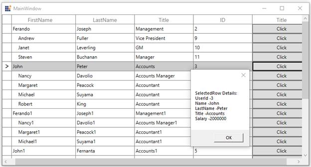

# How to Bind Button Command to ViewModel in WPF / UWP TreeGrid in MVVM?

This example illustrates to bind the Button command to ViewModel in [WPF TreeGrid](https://www.syncfusion.com/wpf-controls/treegrid) and [UWP TreeGrid](https://www.syncfusion.com/uwp-ui-controls/treegrid) (SfTreeGrid).

You can load a button for the columns in TreeGrid using [TreeGridTemplateColumn](https://help.syncfusion.com/cr/wpf/Syncfusion.UI.Xaml.TreeGrid.TreeGridTemplateColumn.html). When loading the buttons, you can bind a command in ViewModel using ElementName binding.

### XAML:
``` xml
<syncfusion:TreeGridTemplateColumn MappingName="Title" 
                                   syncfusion:FocusManagerHelper.WantsKeyInput="True">
       <syncfusion:TreeGridTemplateColumn.CellTemplate>
           <DataTemplate>
               <Button  Content="Click" syncfusion:FocusManagerHelper.FocusedElement="True" 
                        Command="{Binding Path=DataContext.RowDataCommand,ElementName=treeGrid}" 
                        CommandParameter="{Binding}"/>
           </DataTemplate>
       </syncfusion:TreeGridTemplateColumn.CellTemplate>
</syncfusion:TreeGridTemplateColumn>
```

